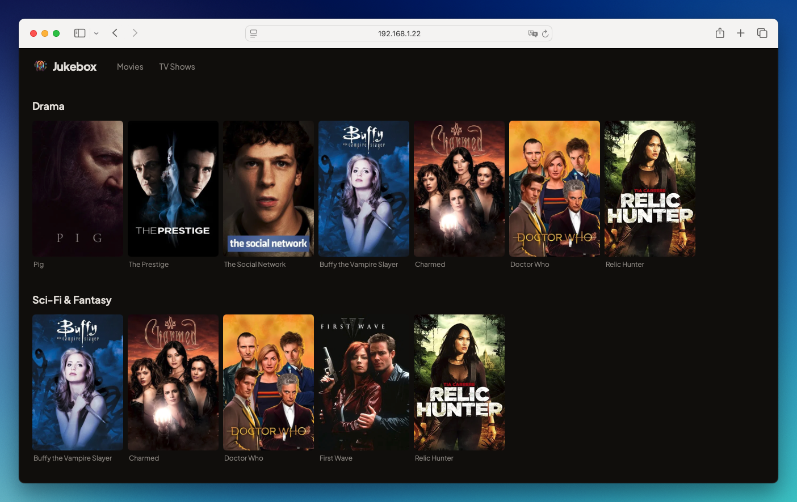
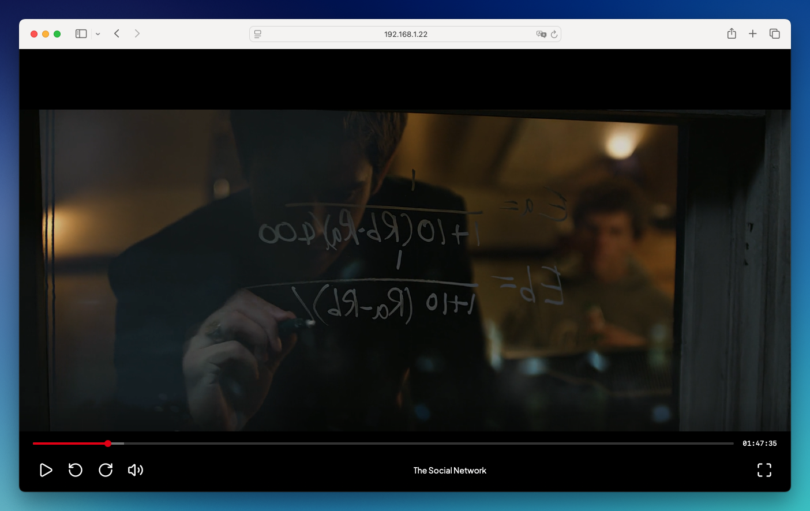

# Jukebox

A self-hosted media server with a Netflix-style interface for browsing and
streaming your personal movie and TV show collection.



## Features

- **Netflix-style UI** — browse your library with poster art, backdrops, and
  rich metadata
- **Movies and TV shows** — automatic detection of episodes, seasons, and series
- **Automatic metadata** — fetches titles, posters, backdrops, ratings, and
  trailers automatically. No API key required.
- **Video streaming with seeking** — stream any common video format with full
  range-request support
- **Watch progress** — automatically saves and resumes playback position
- **Trailer previews** — watch YouTube trailers directly from the details panel



## Requirements

- [Node.js](https://nodejs.org/) 18 or later (or [Bun](https://bun.sh/))
- [ffmpeg](https://ffmpeg.org/) on your `PATH` (used for media probing and
  on-the-fly transcoding)

## Installation

Install globally from npm:

```bash
npm install -g jukebox-media-server
```

Or run it without installing:

```bash
npx jukebox-media-server@latest
```

Using [Bun](https://bun.sh/)? It works too:

```bash
bunx jukebox-media-server@latest
```

## Getting Started

1. **Start Jukebox**

   ```bash
   jukebox-media-server
   ```

   Then open `http://localhost:1990` in your browser.

2. **Add your library**

   On first launch, the setup screen asks you to point Jukebox at the folders
   containing your movies and TV shows. It will recursively scan for video
   files, parse titles and years from filenames, and fetch metadata
   automatically — no API key needed.

3. **Watch**

   That's it — your library is ready.

## Configuration

Jukebox stores its data in `~/.jukebox/`:

- `~/.jukebox/jukebox.db` — SQLite database with library paths, metadata, and
  watch progress

Environment variables:

| Variable                   | Description                            | Default                                          |
| -------------------------- | -------------------------------------- | ------------------------------------------------ |
| `PORT`                     | Server port                            | `1990`                                           |
| `JUKEBOX_METADATA_API_URL` | Override the metadata service endpoint | `https://movie-data-api.artgaard.workers.dev` |

## Casting

Jukebox supports **Chromecast** (Chrome) and **AirPlay** (Safari/iOS) from
the video player control bar.

- **Chromecast**: your Chromecast must be on the same local network as the
  machine running Jukebox, and the Jukebox server must be reachable from the
  Chromecast by its IP/hostname (not `localhost`). Cast sessions load the
  media directly from the Jukebox stream URL, so the Chromecast needs LAN
  access to the server.
- **AirPlay**: works natively on Safari and iOS. `.mkv` files are not
  supported by AirPlay, so Jukebox transcodes them on the fly to HLS
  (requires `ffmpeg` on the server's `PATH`).

If casting fails with "Chromecast couldn't reach Jukebox", check that the
Chromecast can reach the server's IP on the port Jukebox is listening on.

## Supported Formats

`.mp4`, `.mkv`, `.avi`, `.mov`, `.wmv`, `.m4v`, `.webm`, `.flv`, `.mpeg`,
`.mpg`

## File Naming

Jukebox parses titles and years from filenames. For best results:

**Movies:**

- `Movie Title (2020).mkv`
- `Movie.Title.2020.1080p.BluRay.mkv`
- `Movie Title [2020].mp4`

**TV shows:**

- `Show Name/Season 01/Show Name - S01E01 - Episode Title.mkv`
- `Show Name/Season 1/Show.Name.S01E01.mkv`

## Updating Your Library

Re-run a scan from the UI any time you add new files. Jukebox only fetches
metadata for files it hasn't seen before, so subsequent scans are fast.

## Contributing

Bug reports, feature requests, and pull requests are welcome. See
[CONTRIBUTING.md](CONTRIBUTING.md) for development setup and guidelines.

## License

[MIT](LICENSE)

